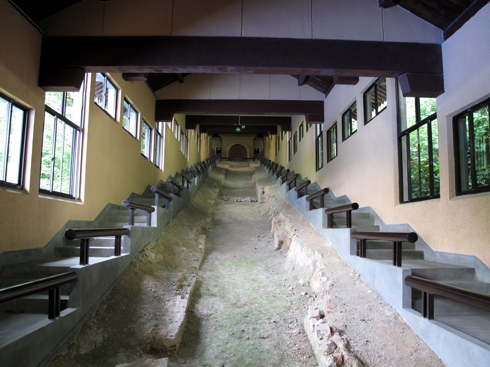

# 第 2 章 · 火的工程

## 2.1 三种形状

第一章讨论的是一座窑场和一种瓷器的极限。这一章往后退一步，看产生这种瓷器的物理装置——窑炉。

中国陶瓷史上出现过几十种窑型。这一章只挑三种，因为它们是三种完全不同的工程思路：

- 沿山坡铺设的长隧道（龙窑）
- 平面圆形、剖面像半个馒头的密闭窑（馒头窑）
- 平地建造的躺倒鸡蛋形结构（镇窑或蛋形窑）

三者的差别不只是形状，更是对"如何让一炉火稳定地把几千件瓷器烧到 1280°C"这件事三种完全不同的回答。这一章按时间顺序看这三种回答如何依次出现，又如何共同构成一个叠加的工程谱系。

## 2.2 龙窑：南方山坡上的隧道

龙窑出现于商代晚期至战国，主要盛行于南方丘陵地区，一直沿用到南宋及之后。它的形状是一条沿山坡铺设的长隧道。考古发现的龙窑长度随年代而变化：早期（春秋战国）龙窑长度约 10–15 米；唐宋时期相对稳定在 50 米左右；2013 年江西**景德镇乐平接渡镇南窑遗址**发现的中晚唐龙窑长达 78.8 米，是目前考古揭露最长的唐代龙窑 [^20] [^B1]。

南窑遗址值得稍微展开。它始烧于中唐，兴盛于中晚唐，衰落于晚唐，距今约 1200 多年。考古队 2013 年 3 月至 11 月对遗址进行发掘，揭示龙窑遗迹 2 座、灰坑 10 个、灰沟 1 条、道路遗迹 1 条，总计揭露面积 1013.5 平方米，出土窑具和瓷片标本数十吨。78.8 米的那条龙窑，北壁有 13 处窑门——也就是说窑工分十三段沿坡上推燃烧前沿。整个南窑遗址的分布面积超过 3 万平方米。这一发现入选 2013 年度中国十大考古新发现，把瓷都景德镇的瓷器烧造历史向前推进了一步 [^B1]。

倾斜角度通常 10° 到 20°。山下是窑头（点火处），山上是窑尾（烟道）。

> 图 2.1　杭州郊坛下南宋官窑遗址的龙窑（约 40 米长、2 米宽）。窑炉沿山坡铺设，是这种"隧道形顺坡爬升"工程思路的典型实物。来源：G41rn8/Wikimedia Commons，CC BY-SA 4.0。

这个形状不是审美选择，是物理选择。

热空气往上走。把整个窑斜着搭，等于让燃烧产生的热气流自然形成一个从下往上的对流。窑头点火后，热气从坡底向上推进，沿途加热整条隧道内的器物。窑工在隧道两侧每隔几米开一个投柴孔（"窑眼"），等下面那段烧到温度后，从下一个孔继续添柴，让燃烧前沿一段段往上推。

一座 50 米长的龙窑单次能装数千到上万件器物。从点火到熄火，约 20 到 30 小时。投柴间隔大约 15 到 30 分钟一次，整个烧成期间连续不断。一窑下来需要几名窑工轮班，没人能从头到尾守到结束。

### 龙窑的工程优势

一是**热效率高**。利用自然对流，不需要鼓风。和同等容积的水平窑相比，燃料消耗显著低一些（具体数据因窑型差异较大，下一稿需补具体复原实测数据）。

二是**装窑量大**。单次出窑数千件，对民用瓷的规模化生产是决定性优势。同一窑一夜烧出几千件碗，这是市场端能形成稳定供应的前提。

三是**温度梯度可用**。从窑头到窑尾，温度从最高到最低渐变。窑头那一段最热的位置叫"火膛"，1300°C 以上；窑尾接近烟道的位置约 1100°C。这意味着同一座窑可以同时烧不同要求的器物——粗瓷放窑尾低温段，精瓷放窑头高温段。这个特性后来被景德镇的镇窑发扬到极致。

### 龙窑的工程劣势

最大的问题是**温度均匀性差**。窑内同一段，靠近火道的器物比远离火道的高 50°C 以上。窑工要靠装窑时器物的位置选择来补偿——这种知识完全靠师徒口传。

第二个问题是**对地形依赖大**。必须有合适倾角的山坡，没有山坡的地方搭不出来。这就是为什么龙窑集中在南方丘陵区——浙江、福建、江西。北方平原烧不了龙窑，必须用另一种思路。

第三个问题是**还原焰难以稳定**。龙窑的开放结构让冷空气容易从投柴孔倒灌，气氛在氧化焰和还原焰之间摇摆。汝窑那种对气氛要求极严的青瓷，龙窑做不出来——这是为什么北方的汝、定、钧、官，都用另一种窑型。

## 2.3 馒头窑：北方的圆顶

馒头窑因形得名——剖面像半个馒头。其雏形最早出现于西周时期，主要分布在中国北方，是定窑、钧窑、磁州窑、汝窑等北方名窑使用的主要窑型 [^21]。一般馒头窑长约 2.7 米、宽约 4.2 米、高约 5 米以上，是一个相对密闭的圆顶空间。

它的工程逻辑和龙窑完全相反：龙窑利用自然对流，馒头窑反过来——用密闭空间和顶部烟道，强制热气流在窑内循环一圈再排出。

窑底中央或一侧是燃烧室（"火膛"），燃料在这里燃烧产生的热气往上升、撞到圆顶后向四周扩散，然后沿窑壁和器物之间下降，最后从底部的烟道排出。这种"从顶到底"的循环结构让窑内温度比龙窑均匀得多。

更关键的是，馒头窑的密闭性让**还原气氛可控**。窑工通过控制烟道的开闭、燃料投放的多少，可以精确调节窑内的氧分压。这是烧汝窑、钧窑、定窑这些对气氛要求严苛的青瓷或白瓷的前提。

馒头窑单次装窑量约几百件，远小于龙窑。烧成时间约 15 到 30 小时。最高温度可达 1280°C 以上，足够烧瓷。

### 燃料的差异

龙窑烧松柴，馒头窑烧煤——这是地理条件决定的工程选择。

松柴燃烧温度高（火焰温度可达 1400°C 以上），火焰长，适合龙窑那种沿隧道推进的燃烧前沿。但松柴消耗大——一窑数千件器物要烧掉几吨到几十吨柴。南方山区松林密布，能支撑这种消耗。

煤的火焰短、热值更稳定、单位体积发热量大，适合馒头窑这种相对静止的燃烧。北方煤矿丰富——河南、河北、山西的煤层埋藏浅，是中国早期煤炭工业的天然基地。

煤还有一个隐藏问题：含硫高。如果窑内气氛失控，硫会进入釉层污染颜色。这就是为什么钧窑（窑变红、紫、蓝）反而成了北方馒头窑的特长——窑工有意识地利用煤气氛中的还原与硫化成分，让铜在釉中发生不稳定的呈色，把"杂质"转成产品特征。

钧窑的窑变在中国陶瓷史上是个有趣的工程案例：当工艺无法稳定控制颜色时，把不可控本身变成审美——每一件都不一样、每一件都不完全可预测。这是把工程不确定性产品化的早期例子。

## 2.4 镇窑：景德镇的蛋形革命

景德镇窑型从龙窑到蛋形窑（镇窑）的过渡，经历了几个中间形态。

**葫芦窑**——元代景德镇湖田窑等窑场首创的一种过渡形制 [^B2]。它由传统龙窑演变而来，外形像两个相连的葫芦——前室宽大、后室窄长。葫芦窑克服了龙窑过长难控制温度和气氛的缺点，是中国窑炉演化史上一个关键的中间环节。湖田窑遗址的考古发掘揭露了具有明显葫芦窑特征的元代窑炉。

到了明代，葫芦窑继续演变；**清代乾隆初年（约 18 世纪初）景德镇的"镇窑"（蛋形窑）正式成熟** [^B3]。这就是后来作为景德镇标志的窑型。学界对这一窑型的命名和定型时间有多种说法——百度百科条目把"镇窑始建"标在距今约 300 年的清代乾隆初年，澎湃和故宫研究材料中对这一时间的描述略有差异，但主流意见同意：明末清初是它的雏形期、清代中期是它的成熟期。

它的形状是一个躺倒的鸡蛋。窑身长约 18 米，最大宽度约 6 米，高约 5 米，容积约 160–200 立方米 [^22]。两端封闭，一端是火膛、另一端是烟囱，中间是装窑空间。

这个形状是龙窑和馒头窑的工程综合：

- 像龙窑那样**水平延伸**——可以装大量器物，单次约 1 万件
- 像馒头窑那样**密闭可控**——气氛稳定，能烧高品质瓷
- 但它**不依赖山坡**——平地上就能搭，景德镇就是平原沿河

### 容积演进：景德镇窑炉的体量曲线

镇窑的容积是逐步增长的结果。明代中后期，官窑窑炉容积约 5.25 立方米；同期民窑约 17.5 立方米；清康熙朝增加到约 68 立方米；雍正、乾隆朝约 81 立方米；到清末，已增长到 160–180 立方米的成熟蛋形窑形态 [^22]。两百多年里，单座窑的体量增长了约三十倍。

### 单座窑内的多温度区

镇窑的关键设计是**单座窑内同时存在多个温度区**。

火膛附近 1320°C，往烟囱方向逐渐降低，到尾段约 1100°C。这个温度梯度让一座窑同时烧不同种类的产品：

- 高温段：青花、釉里红等需要 1300°C 以上还原焰的高档瓷
- 中温段：普通白瓷、青白瓷
- 低温段：薄胎瓷、粗瓷、修补类器物

成熟的蛋形大柴窑一次装窑量可达 10–15 吨日用瓷，约合 200–300 担，单窑产量是明初官窑（5.25 立方米）的 40–60 倍 [^22]。一炉火服务多条产品线，是单一工业装置一次完成多产品生产的早期例子。

### 烧成节奏

一窑镇窑的完整周期约 30 到 40 小时：

- 头 6 小时：缓慢升温到 800°C，避免器物开裂
- 6 到 18 小时：从 800°C 升到 1100°C，转入还原焰
- 18 到 24 小时：保温在 1280-1320°C
- 24 到 36 小时：缓慢冷却至 600°C
- 36 小时后：自然冷却到 200°C 以下，开窑

期间投柴间隔从开始的 30 分钟一次缩短到高温期的 10 分钟一次。一窑松柴消耗在数吨到十几吨之间（具体数据下一稿需补景德镇陶瓷研究所或现代复原实测）。

## 2.5 一座城的火与林

景德镇之所以能成为千年瓷都，与它周围山区盛产的马尾松直接相关。马尾松树脂含量高、燃烧温度高，是柴窑首选燃料。景德镇所辖的浮梁县（宋代为浮梁县，景德镇当时为其治下镇）名字本身就暗示了这一关系——县名释义为"以溪水时泛，民多伐木为梁"，描述的正是当地居民利用河水涨水时漂运木材的传统 [^23]。这种漂木运输方式从宋代一直延续到晚清。

镇窑作为景德镇主力窑型，从明代中后期至清代盛行三百多年。一窑一次烧成消耗松柴数吨到十几吨，景德镇高峰期同时运转的窑炉至少数十座，每年松柴消耗在万吨级以上（具体数据下一稿需查《浮梁县志》及现代研究综述）。一个佐证数据：根据故宫博物院的研究，到了 1949 年后景德镇陶瓷生产恢复期，每年仍需要约 40 万立方米木柴 [^24]——这还是规模缩小、煤炭部分替代之后的数字。

这种长期、大规模的松柴消耗对周边山林产生了显著压力。明清两代景德镇周边浮梁、婺源、徽州一带山区先后被持续采伐用于供柴。柴源不得不从越来越远的山区水运而来——一吨松柴的运输成本（水运、装卸、劳力）最终都反映在每件瓷器的成本里。

景德镇能持续烧瓷三百多年而没有彻底耗尽资源，部分原因是江西、安徽、福建丘陵适合马尾松再生——只要砍伐周期与生长周期匹配，就能维持一种慢速的可再生供应。但到了清末民初，这种平衡被打破，加上煤炭逐步替代松柴的进度，传统柴烧镇窑的工业模式开始走向终结，二十世纪转向煤窑、气窑、电窑。

这是中国早期工业最早的一批生态后果之一。把一座城的火持续烧三百年，需要数个山区的森林——这是工业系统的物质代价。

## 2.6 温度梯度作为工程资源

从龙窑到馒头窑到镇窑，三百年间，中国窑工把"窑内温度不均匀"这件事从工程缺陷转成了工程资源。

最早的龙窑里，温度梯度是必须容忍的副产品——窑工的目标是尽量减少它，把所有器物尽可能放在一个温度区间内烧成。到了镇窑，温度梯度变成主动设计的特性——同一座窑同时生产多种产品，每个温度区放对应需要的器物。

这种"把缺陷变成资源"的工程转变，在十二世纪到十六世纪中国陶瓷业里完成。

这个思路在现代工业中并不陌生。半导体行业的退火炉同样利用温度梯度同时处理不同工艺要求的硅片；冶金行业的连续退火线也是利用温度区段实现多步处理。把单一装置的不均匀性转化为多任务处理能力，是工程系统成熟的一个标志。

中国窑工没有"系统工程"的术语，但他们把这条逻辑走完了。

## 2.7 一座窑场的运转

一座大型窑场不是一座窑，是一组建筑加一个组织。

景德镇明清时期一个典型的官窑作坊包括：

- 取土场：在山里挖瓷石和高岭土
- 淘洗场：水力舂土、淘洗、过筛
- 釉料房：磨制釉料、配方
- 拉坯房：成型，每个工匠负责特定形制
- 上釉房：上釉、装匣
- 装窑房：把器物装进匣钵、按位置摆进窑
- 窑炉：烧成
- 选拣房：开窑后挑拣、销毁次品

每个环节有专门的师傅。拉坯的不上釉，上釉的不装窑，装窑的不烧火。整个流程是流水线分工的早期形态。

亚当·斯密在《国富论》（1776 年）开篇讨论分工时举的例子是制针作坊——一根针的制作分成 18 道工序，每个工人只做其中一两道。但景德镇在十六世纪已经把这种分工推到了几十道工序——后来民间总结为"七十二道"。这个数字可能是文学化的概括，但分工密度的方向是真的。

这就引出下一章——七十二道工序。中国瓷器的工业化不只是物理设备的演进，也是分工系统的演进。窑炉提供物理基础，分工提供组织基础。两者加起来才构成完整的工业系统。

---

## 参考文献

[^20]: 龙窑长度演变。商代晚期至春秋战国早期龙窑长度约 10–15 米；唐宋时期龙窑长度通常约 50 米。2013 年江西景德镇南窑发现唐代龙窑长 78 米，是目前已知最长的早期龙窑。维基百科条目"龙窑"https://zh.wikipedia.org/wiki/%E9%BE%99%E7%AA%91；2005 年中国十大考古新发现资料。

[^21]: 馒头窑形制与北方分布。馒头窑雏形出现于西周，主要分布于中国北方，是定窑、钧窑、磁州窑、汝窑等北方名窑的主要窑型。一般尺寸长约 2.7 米、宽约 4.2 米、高约 5 米以上。中国社会科学网《景德镇馒头窑及其技术源流》https://www.cssn.cn/kgxc/kgxc_kgxl/202302/t20230202_5585654.shtml

[^22]: 景德镇窑炉容积演进数据。明代官窑约 5.25 立方米，民窑约 17.5 立方米；清康熙约 68 立方米；清雍正乾隆约 81 立方米；清末蛋形窑成熟形态约 160–180 立方米；蛋形大柴窑容积约 160–200 立方米，单窑装日用小器 10–15 吨（约 200–300 担），是明代官窑产量的 40–60 倍。故宫博物院学术资源《明清景德镇瓷业发展与窑柴的应对》https://www.dpm.org.cn/Uploads/File/2024/09/09/u66de68767a89d.pdf

[^23]: 浮梁县名释义"以溪水时泛，民多伐木为梁"。维基百科"浮梁县"条目；湖南广电华声在线《景德镇的自古以来：浮梁烟火》https://m.voc.com.cn/xhn/news/201808/14549693.html

[^24]: 景德镇 1949 年后木柴年需求约 40 万立方米。引自景德镇陶瓷历代烧造窑炉编汇资料；参见故宫博物院学术资源出版物（同 [^22]）。

[^B1]: 景德镇南窑遗址 78.8 米唐代龙窑。江西省景德镇乐平市接渡镇，2013 年 3-11 月由江西省文物考古研究所等单位发掘，揭示龙窑 2 座、灰坑 10 个等，揭露面积 1013.5 平方米，出土窑具瓷片数十吨。78.8 米龙窑北壁有 13 处窑门。该遗址始烧于中唐、兴盛于中晚唐。入选 2013 年度中国十大考古新发现。中国考古《景德镇南窑发现唐代最长的龙窑遗址》http://kaogu.cssn.cn/zwb/xccz/201312/t20131216_3927962.shtml；中新网《景德镇发现唐代最长龙窑遗迹长达 78.8 米》https://www.chinanews.com.cn/tp/hd2011/2013/12-10/275315.shtml

[^B2]: 葫芦窑首创于元代景德镇，由龙窑演变而来，克服了龙窑过长难控制温度和气氛的问题。湖田窑（自五代至明代延续约 700 年）的考古发掘揭露了具有葫芦窑特征的元代窑炉。澎湃新闻《古窑址寻访②｜七百年窑火延续，"村村陶埏"是湖田》https://m.thepaper.cn/wifiKey_detail.jsp?contid=10592537&from=wifiKey；中国国家文物局《江西景德镇南窑唐代窑址》http://www.ncha.gov.cn/art/2022/5/25/art_2614_174514.html

[^B3]: 镇窑（蛋形窑）是明末清初景德镇开创、清代乾隆初年成熟的窑型，由龙窑、马蹄窑、葫芦窑的优点综合发展而来。一座窑一根烟囱，结构相对简单，适宜快烧快冷。百度百科"景德镇窑"条目 https://baike.baidu.com/item/%E6%99%AF%E5%BE%B7%E9%95%87%E7%AA%91/1687801

---

> 起稿：2026-04-27（第三稿，已加入考古实测与文献引用）
> 字数：约 5800
> 状态：2.1–2.7 完成。文献编号 [^20]–[^24] 已对照公开来源补全。下一稿可继续核查：龙窑燃料消耗对比水平窑的具体百分比；明清景德镇运转窑炉座数的精确数据；《浮梁县志》柴价记载原文。
