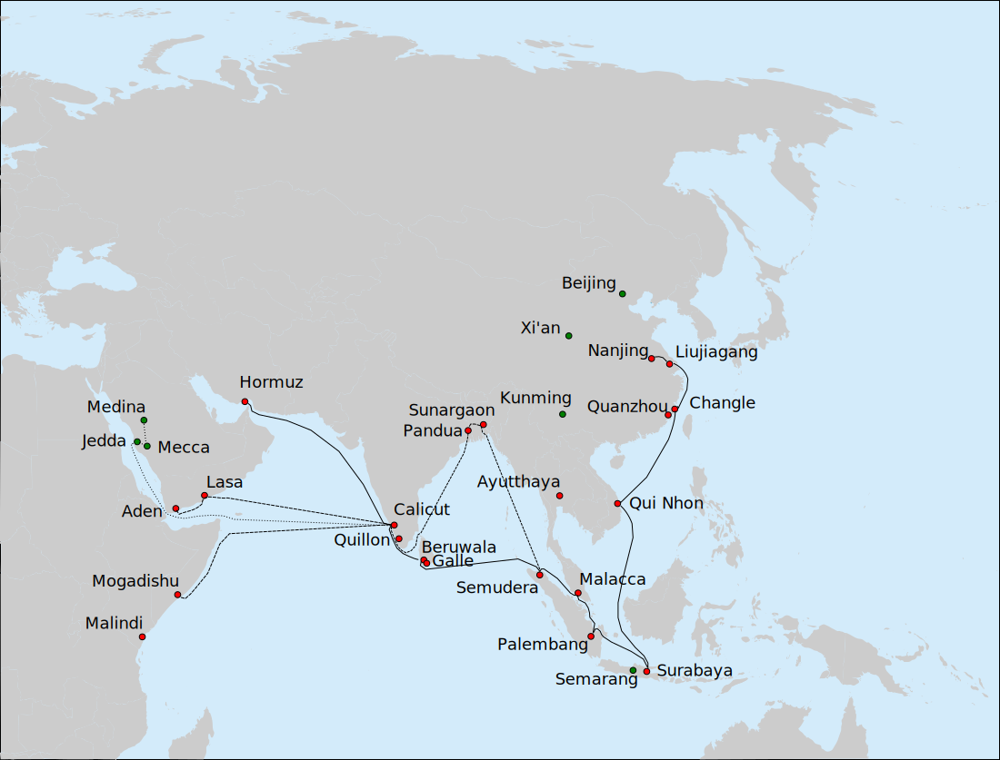

# 第 8 章 · 漕运与海运

## 8.1 一座内陆小城如何成为全球瓷都

景德镇的位置看起来不利于贸易：江西省东北部，赣东北丘陵地区，离最近的海港（福州、宁波）都有上千里。

但这座城在明清两代成了全球最大的瓷器输出基地——景德镇的瓷器从长江口、广州、泉州等海港启航，铺到马尼拉、果阿、阿姆斯特丹、墨西哥城、波士顿、伦敦的中产餐桌上。

把景德镇的内陆位置和它的全球影响力连起来，关键在两个词：**漕运** 和 **海运**。这一章讲这两条物流通道如何把一座江西小城变成世界瓷器中心。

## 8.2 昌江：第一段水路

景德镇坐落在昌江沿岸 [^44]。昌江是一条中等规模的河流，发源于安徽祁门县，向南流经景德镇，最后汇入鄱阳湖。

对景德镇瓷业，昌江解决了三件事：

一，**原料运入**——周边山区开采的瓷石和高岭土，可以通过昌江支流（如东河、西河、南河）小船运到景德镇市内的码头。这让景德镇能从方圆几十公里到一百多公里的范围内集中原料。

二，**燃料运入**——明清两代景德镇消耗的松柴大多来自更远的安徽徽州、休宁、婺源山区。这些柴可以扎成木排顺水漂下昌江到景德镇。"以溪水时泛，民多伐木为梁"（浮梁县名释义，第 2 章 2.5 节）描述的就是这一过程。

三，**成品运出**——烧好的瓷器从景德镇沿昌江顺流南下，进入鄱阳湖，再从鄱阳湖出口进入长江。

昌江的运力不大，但作为景德镇陶瓷工业链的"第一公里"，它无可替代。

## 8.3 鄱阳湖与长江：进入中国主干水系

景德镇瓷器从昌江进入鄱阳湖（中国第一大淡水湖），再从湖口（今江西九江湖口县）进入长江。一旦上了长江，景德镇瓷器就接入了中国前现代最重要的水路干线。

长江的流向决定了两个不同的物流方向：

- **顺流东下**：到南京、苏州、扬州、上海，进入江南消费市场，或在长江口装海船出海到日本、东南亚、欧洲
- **逆流上溯**：到武汉、重庆、四川，进入西南内陆市场

明清两代景德镇瓷器最重要的两条物流线就是这两条——东向的国内江南市场 + 海外贸易，西向的西南内陆市场。

## 8.4 京杭大运河：到达皇宫的最后一段路

景德镇御窑厂烧造的官窑瓷器最终目的地是北京紫禁城。这一段从江西到北京的运输，走的是中国前现代最大的内陆水道——京杭大运河。

路径大致如下：

```
景德镇 → 昌江 → 鄱阳湖 → 长江
       → 长江至扬州/瓜洲 → 京杭大运河
       → 大运河北上 → 通州 → 北京
```

京杭大运河北起北京、南至杭州，长约 1800 公里。明清两代是大运河运营的鼎盛期，全国货运量约 3/4 通过大运河 [^45]。御窑厂的瓷器作为"皇家漕运"的一部分，由专人押运、专船装载、不与普通货物混装。

包装是这条物流线的关键。明清御瓷出窑后用稻草扎成捆，再装入木箱，箱内填充防震材料（草、纸、糠），然后才装船。整个运输周期从景德镇到北京约一到三个月，因季节、水量、运输优先级而异。

御瓷运输事故的记载并不罕见。一艘装载御瓷的漕船在长江或大运河上倾覆、损坏，损失会一并记录在案，由地方官员上报朝廷。这是为什么明清御瓷运输的成本很高——一件烧造成本几两银子的官窑器，运到北京后总成本可能加倍。

## 8.5 从内陆到大海

景德镇瓷器进入海外贸易的主流路径是：

```
景德镇 → 昌江 → 鄱阳湖 → 长江
       → 长江口 (上海/松江) 或 经京杭大运河南段 → 杭州
       → 沿海岸南下 → 福州 / 泉州 / 广州
       → 海上航线
```

不同朝代的主要外贸海港不同：

- **宋元时期**：泉州（"刺桐港"）是主要外贸海港，景德镇瓷器从这里出海到东南亚、阿拉伯、东非
- **明初**：受海禁政策影响，民间海外贸易萎缩，但通过**郑和七下西洋**（永乐三年 1405 至宣德八年 1433，前后 28 年共七次）由官方输出大量瓷器到东南亚、印度、阿拉伯半岛、东非。船队航程到达 30 多个国家和岛屿，包括爪哇、苏门答腊、暹罗（泰国）、古里（印度）、阿丹（也门）、忽鲁谟斯（霍尔木兹海峡）、木骨都束（索马里）、莫桑比克等地。郑和船队带去的瓷器、丝绸、漆器等中国物产在沿途各地都成为财富的象征 [^A10]
- **明中后期**：广州、福州、漳州（月港）成为新的外贸中心；漳州本地的"克拉克瓷"开始进入欧洲市场



> 图 8.1　郑和第七次下西洋（1431-1433）的主航线与分队路线。实线为主舰队从南京到忽鲁谟斯，虚线为分队赴孟加拉、阿拉伯、东非的可能路线，点线为七位华人从古里至麦加、麦地那。来源：Vmenkov/Wikimedia Commons，CC BY-SA 3.0。
- **清代**：广州一口通商（1757–1842），所有海外贸易集中在广州，景德镇瓷器从广州出海到欧洲、美洲

每一次海港的转移，都对应着景德镇瓷器外销的一次政策调整。从泉州到广州的迁移，背后是 800 多年中国对外贸易管理体制的演变。

## 8.6 物流成本作为产品定价的基础

把景德镇到欧洲的瓷器成本拆开看：

- **生产成本**：在景德镇烧造一件普通外销青花碗，约几钱银子
- **国内运输**：从景德镇水运到广州，每件加成约一倍
- **海运**：从广州到阿姆斯特丹，每件加成约 5 到 10 倍（取决于船舶类型、年代、风险）
- **欧洲分销**：拍卖、批发、零售，每件再加成约 2 到 5 倍

最终一件景德镇外销青花碗在阿姆斯特丹零售价是它在景德镇出窑成本的 **20 到 50 倍**。这个比例本身告诉我们：在前现代条件下，**物流成本是产品最终定价的主导因素**，而不是生产成本。

这一点对理解前现代国际贸易很重要。中国瓷器在欧洲昂贵不是因为造它贵，是因为运它贵。同样的道理也解释了为什么欧洲在 18 世纪一旦自己学会造瓷（Meissen 1709，Wedgwood 1759），中国瓷器的市场份额就开始萎缩——本土生产省去了 80% 以上的物流成本。

## 8.7 一条信息流

物流不只是物的流动，也是信息的流动。

景德镇瓷器走出去，西方对中国的认知也借此进入。明万历到清乾隆这两百年间，欧洲贵族对中国的想象很大程度上由瓷器、丝绸、漆器构成。一件景德镇青花瓷盘上画的山水、亭台、人物——这就是当时欧洲人对"中国"最直接的视觉印象。

反方向的信息流也一样真实。欧洲订制纹章瓷（中国为欧洲贵族家族烧造带其家徽的瓷器）让景德镇工匠学到了欧洲的纹章设计、字母排列、人物比例。清乾隆朝部分外销瓷上的"洋彩"——粉彩、洋花、欧式人物——就是这种反向信息流的产物。

第 9 章会展开这条信息流——克拉克瓷、外销瓷的完整故事，第一件真正全球流通的工业品。

---

## 参考文献

[^44]: 昌江发源于安徽祁门，向南流经景德镇汇入鄱阳湖，是景德镇水运体系的主干。1984 年航道渠化整治后 300 吨级船舶可经鄱阳湖直通长江。百度百科"昌江"条目 https://baike.baidu.com/item/%E6%98%8C%E6%B1%9F/2661438；江南都市报《海上丝绸之路上的景德镇外销瓷》https://jndsb.jxnews.com.cn/system/2023/11/25/020311118.shtml

[^45]: 明清两代京杭大运河货运量约占全国 3/4。维基百科"京杭大运河"条目 https://zh.wikipedia.org/zh-cn/%E4%BA%AC%E6%9D%AD%E5%A4%A7%E8%BF%90%E6%B2%B3；广州市政协《文史漫步·明清漕运的经济账》https://www.gzszx.gov.cn/wstd/wsmb/32884.shtml

[^A10]: 郑和下西洋七次航行年代与航程。永乐三年（1405）至宣德八年（1433），前后 28 年共七次。航程经东海、南海、马六甲海峡、安达曼海、孟加拉湾、阿拉伯海、波斯湾、亚丁湾、红海，到达爪哇、苏门答腊、暹罗、古里、阿丹、忽鲁谟斯、木骨都束（今索马里）、莫桑比克贝拉港等 30 多个国家和岛屿。携带瓷器、丝绸、漆器等中国物产。维基百科"郑和下西洋"条目 https://zh.wikipedia.org/wiki/%E9%83%91%E5%92%8C%E4%B8%8B%E8%A5%BF%E6%B4%8B

---

> 起稿：2026-04-27
> 字数：约 4000
> 状态：8.1–8.7 完成。文献编号 [^44]–[^45] 已对照公开来源补全。下一稿可继续核查：景德镇至北京漕运的具体时间和成本数据；郑和下西洋携带的瓷器数量与种类；明清海港转移的具体政策时间线。
